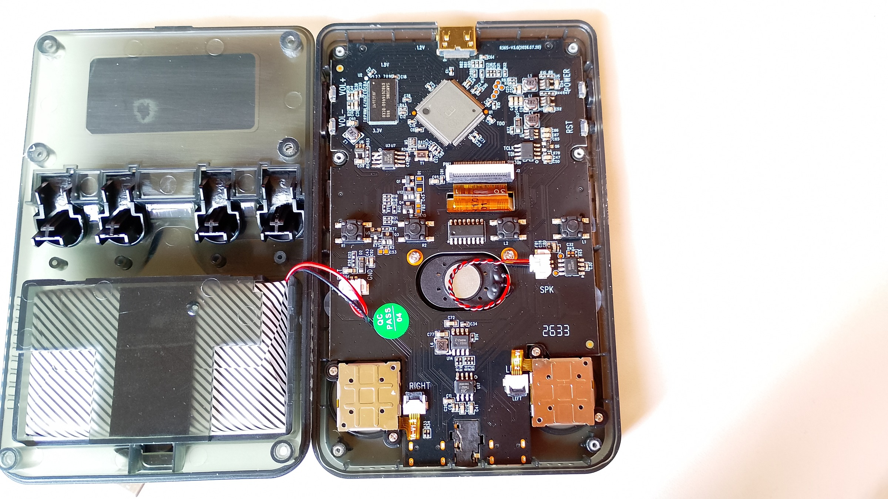

# Richard's R36SX V3.0

## H.OS 1.2 — PCB `R36S-V3.0 (2026.07.20)`

This repository documents my **R36SX V3.0**, an R36S-looking handheld that belongs to the **R36SX / GB350-style clone family**, rather than the original RK3326-based R36S family.

Yes, it is basically a fake R36S. :)

But I love this little device anyway.

Despite its hardware and software limitations, it has been surprisingly fun to investigate, modify and experiment with. The community around these inexpensive handhelds is also constantly discovering new things about them.

My unit uses the following PCB revision:

```text
R36S-V3.0 (2026.07.20)
```

and originally came with:

```text
H.OS v1.2
```

This repository is my personal documentation of this particular hardware revision, including hardware identification, stock firmware analysis, backups, TreeFrogUI experiments, USB peripherals, HDMI testing and other findings.

---

# Important warning

**Do not assume this device is compatible with firmware made for the original R36S.**

The original R36S commonly uses an RK3326-based platform and systems such as ArkOS.

This V3.0 console belongs to a different hardware and software family.

Therefore, firmware images, DTBs, boot files or operating systems intended for the original R36S should **not** be used on this device unless compatibility has been specifically confirmed.

The V3.0 should also not automatically be assumed to be compatible with earlier R36SX revisions such as V2.6 or V2.7.

Before experimenting with firmware or storage:

> **Make a complete backup of the original SD card first.**

---

# Device information

| Item | Details |
|---|---|
| Device | R36SX |
| External design | R36S-style handheld |
| Hardware family | R36SX / GB350-style clone |
| PCB revision | `R36S-V3.0 (2026.07.20)` |
| Stock operating system | H.OS v1.2 |
| CPU architecture | MIPS userspace confirmed |
| Exact SoC | Unknown |
| RAM | 256 MiB Samsung DDR3 |
| RAM chip | `Samsung K4B2G1646Q-BCK0` |
| HDMI | Yes, confirmed working |
| TF slots | Two physical slots: `TF1-OS` and `TF2-GAME` |
| Stock SD structure | `cubegm` + `rootfs` |
| Alternative frontend tested | TreeFrogUI |
| Repository | `my-R36SX-HOS-V3.0` |

---

# Hardware

## Main PCB



The main PCB is marked:

```text
R36S-V3.0 (2026.07.20)
```

The board layout differs significantly from the hardware normally associated with the original RK3326-based R36S.

Some of the most important visible components are described below.

---

## Main SoC — U1


The large square IC mounted at an angle near the upper-center of the PCB is marked as:

```text
U1
```

This appears to be the main SoC.

Unfortunately, there is no readable part number on the package in my current photos.

Only a faint stylized logo, resembling a capital **E**, is visible.

Because of this, I do not currently have a reliable identification for the exact SoC model.

The system software contains MIPS executables, so the platform is known to use a MIPS userspace, but I do not want to guess the exact processor only from the package or logo.

**Current status:**

```text
U1: Main SoC
Architecture: MIPS
Exact model: Unknown
```

Identifying this chip is one of the main remaining hardware goals of this project.

---

## RAM — U2


Unlike the SoC, the memory IC is clearly readable.

The chip marked `U2` is:

```text
SAMSUNG
K4B2G1646Q-BCK0
```

This is a Samsung **2 Gbit DDR3 SDRAM** device organized as:

```text
128M × 16
```

That corresponds to:

```text
2 Gbit
= 256 MiB
```

So this V3.0 PCB appears to contain **256 MiB of physical RAM**.

The exact amount reported as available by Linux may be slightly lower because some memory can be reserved for the kernel, framebuffer or other hardware functions.

---

# PCB overview


Visible hardware includes:

- `U1` main SoC;
- `U2` Samsung 256 MiB DDR3 RAM;
- Mini HDMI output at the top of the board;
- display FPC connector near the center;
- internal speaker and `SPK` connector;
- physical `L1`, `L2`, `R1` and `R2` switches;
- `VOL+` and `VOL-` controls on the left edge;
- `POWER` and `RST` controls on the right edge;
- left and right analog-stick assemblies near the bottom;
- USB-C ports on the lower edge;
- two physical microSD/TF slots on the console.

Further investigation is still needed to identify some of the smaller ICs and power-management components.

---

# HDMI output


One of the interesting upgrades on this V3.0 revision is the presence of a **Mini HDMI output**.

HDMI has been confirmed working on my unit.

I tested it successfully with a television and confirmed:

- video output works;
- audio over HDMI works;
- Game Boy and Game Boy Advance games run correctly on the TV;
- HDMI audio sounds considerably better than the console's built-in speaker.

This is one of the most useful hardware improvements I have found on this revision.

---

# Two TF card slots


My console has two physical microSD slots labeled:

```text
TF1-OS
TF2-GAME
```

`TF1-OS` is confirmed to contain and boot the operating system.

The second slot, `TF2-GAME`, is still under investigation.

I have already tested simple ROM folder layouts on a second microSD card, but TreeFrogUI did not automatically detect the games.

The next step is to determine whether Linux detects the second card reader at all during boot.

If the device appears in Linux, it may be possible to mount it manually even if the current frontend does not support it automatically.

For now:

```text
TF1-OS   = confirmed working
TF2-GAME = hardware present, functionality not yet confirmed
```

---

# Stock operating system — H.OS 1.2

My unit originally came with:

```text
H.OS v1.2
```

The stock operating system is **not ArkOS**.

It uses its own Linux-based environment and frontend.

The SD card contains two particularly important directories:

```text
cubegm/
rootfs/
```

Typical ROM directories include:

```text
ATARI/
FC/
GB/
GBA/
GBC/
GG/
MAME/
MD/
NGPC/
PCE/
PS/
SFC/
```

Some important configuration and system files include:

```text
cubegm/setting.xml
cubegm/allfiles.lst
cubegm/cores/config.xml
cubegm/cores/filelist.xml
```

The main frontend is based around binaries such as:

```text
cubegm/rkgame
cubegm/usr/bin/icube
```

Emulator cores are stored as shared libraries.

Because of this architecture, I prefer not to simply describe the entire system as "RetroArch".

It uses Libretro-related emulator cores, but it has its own frontend and system structure.

---

# Testing emulator cores in H.OS

One useful discovery was that specific emulator cores can be assigned to individual games through:

```text
cubegm/cores/filelist.xml
```

This allowed me to test different cores for the same ROM.

For example, I tested several Game Boy, Game Boy Color and Game Boy Advance cores, including:

```text
gpSP
mGBA
VBA-M
TGB Dual
```

For Game Boy Advance, **gpSP** has provided the best overall results on my unit so far.

mGBA did not successfully run some of my GBA tests, while VBA-M worked but performed poorly.

The stock H.OS frontend itself remains quite limited, so I eventually started experimenting with TreeFrogUI.

---

# TreeFrogUI on V3.0

I managed to get:

```text
TreeFrogUI 1.6.0_e
```

running on my V3.0 console.

My current setup was created experimentally by combining the required TreeFrogUI files with files from the V3.0 stock system.

It has been working surprisingly well.

However:

> **TreeFrogUI 1.6.0_e was not specifically made for this V3.0 PCB, so my installation should still be considered experimental.**

I plan to document the installation process and my modifications separately.


---

# HDMI with TreeFrogUI

TreeFrogUI works very well through HDMI while a game is running.

I tested GB and GBA games successfully.

There is currently one strange issue.

After exiting a game and returning to the TreeFrogUI menu while HDMI is connected, the console may produce a **very loud high-pitched screech**.

Disconnecting and reconnecting the HDMI cable fixes the problem immediately.

The same behavior can sometimes occur when using menu-related features such as screenshots while HDMI is connected.

When the HDMI cable is removed:

- the image returns to the handheld display;
- the internal audio returns to normal.

After reconnecting HDMI, TV output works normally again.

This may simply be an incompatibility caused by using an experimental TreeFrogUI installation on hardware that was not officially targeted by that version.

Importantly, normal gameplay itself works well.

In-game save-state key combinations such as:

```text
SELECT + L2 / R2
```

can still be used while playing through HDMI.

---

# USB OTG experiments

The OTG port turned out to have some interesting behavior.

## USB controller

A wired USB controller works with the console.

However, my controller was **not detected when connected directly to the OTG port**.

The same controller works when connected through a USB hub.

I tested this successfully with an Anker powered USB hub.

Interestingly, after the USB host connection had already been established through the hub, the controller could sometimes continue working even after external power was removed from the hub.

This suggests that USB host detection, hub topology and power negotiation may all influence peripheral compatibility.

---

## USB connection to a PC

TreeFrogUI's USB connection to a computer also works.

In my tests, a powered USB hub made this connection considerably more reliable.

The exact behavior may also depend on the USB ports and power characteristics of the host computer.

---

# USB keyboard

A USB keyboard behaves differently from the controllers I tested.

It is detected **directly through the OTG port without requiring a USB hub**.

Even keyboard LEDs work, including:

```text
Caps Lock
```

I later modified my TreeFrogUI environment enough to get actual keyboard input working inside the system.

This opened the door to another experiment that I found particularly interesting.

---

# Programming directly on the R36SX

While looking for ways to play with programming directly on the console, I discovered **LowRes NX** support in TreeFrogUI.

LowRes NX is particularly interesting because its programming language is very similar to BASIC.

The source files are plain text and the syntax is easy to understand and modify.

This gave me an idea:

> Turn the R36SX into a tiny self-contained game development machine.

With:

```text
R36SX
+
small USB keyboard
+
simple text editor
+
LowRes NX
```

it becomes possible to create a very simple development cycle entirely on the handheld:

```text
write code
   ↓
save
   ↓
launch game
   ↓
test
   ↓
return to editor
   ↓
modify
```

No PC is necessary once the environment is available on the console.

---

## Rock Paper Scissors test game

As a simple experiment, I created:

```text
rock-paper-scissors.nx
```

The game uses only the controls available on the handheld and can be placed in:

```text
roms/lowres-nx/rock-paper-scissors.nx
```

Because `.nx` files are plain text, opening the game in a text editor is also a good way to see how simple the LowRes NX syntax is.

It looks and feels very similar to BASIC, making it a fun environment for small experiments.

There may be other TreeFrogUI cores or runtimes that could also be used for programming directly on the handheld.

So far, however, **LowRes NX is the first one I have discovered and tested for this purpose**.

---

# Original SD card

The system depends heavily on the contents of the original microSD card.

For that reason, I consider the original card part of the device firmware and treat it as something that should be preserved.

Before changing, formatting or repairing anything, I created a complete bit-for-bit image of the card.

My basic workflow was:

```text
original SD card
        ↓
complete raw image
        ↓
verify image
        ↓
preserve untouched copy
        ↓
extract filesystem
        ↓
work only on copies / replacement cards
```

Useful Linux tools for this kind of work include:

```text
ddrescue
dd
lsblk
fdisk
blkid
TestDisk
mount
sha256sum
cmp
```

I used `ddrescue` to create the original image and verified it against the physical card.

---

# V3.0 stock firmware backups

I have created two types of backup for this revision.

## Minimal backup

A smaller version containing the files required to preserve and study the V3.0 system without the large ROM collection.

```text
R36SX-HOS1.2-V3.0-Minimal.zip
```

## Full extracted SD card

I also preserved the complete extracted contents of the original SD card for comparison and research.

```text
R36SX-HOS1.2-V3.0-full.zip
```

These backups are intended specifically for studying this V3.0 revision.

They should not be assumed compatible with other R36SX, GB350 or R36S-style boards.

---

# Current hardware identification

| Board reference | Identification | Status |
|---|---|---|
| `U1` | Main SoC | Exact model unknown |
| `U2` | Samsung `K4B2G1646Q-BCK0` | Identified |
| RAM capacity | 2 Gbit / 256 MiB | Identified |
| HDMI | Mini HDMI output | Confirmed working |
| `TF1-OS` | Primary system microSD | Confirmed working |
| `TF2-GAME` | Secondary microSD slot | Under investigation |
| `SPK` | Internal speaker connector | Identified |
| L1/L2/R1/R2 | Physical shoulder-button switches | Identified |

---

# Current project status

- [x] PCB revision identified
- [x] H.OS 1.2 identified
- [x] MIPS userspace confirmed
- [x] Samsung RAM chip identified
- [x] RAM capacity identified as 256 MiB
- [x] Original SD card imaged and preserved
- [x] H.OS filesystem extracted
- [x] HDMI video tested
- [x] HDMI audio tested
- [x] USB controller working through hub
- [x] USB keyboard detected directly
- [x] TreeFrogUI running on V3.0
- [x] LowRes NX tested
- [x] Programming experiment with USB keyboard
- [ ] Exact U1 SoC identified
- [ ] TF2-GAME Linux device identified
- [ ] Clean TreeFrogUI installation documented
- [ ] Keyboard modifications documented
- [ ] HDMI return-to-menu audio problem understood
- [ ] Remaining PCB ICs identified
- [ ] Reverse side of PCB documented
- [ ] Emulator compatibility table completed

---

# Suggested image layout

I suggest keeping repository photographs under:

```text
docs/
└── images/
    ├── r36sx-v3-front.jpg
    ├── r36sx-v3-opened.jpg
    ├── r36sx-v3-pcb.jpg
    ├── r36sx-v3-u1-soc.jpg
    ├── r36sx-v3-u2-ram.jpg
    ├── r36sx-v3-hdmi.jpg
    ├── r36sx-v3-tf-slots.jpg
    └── r36sx-v3-treefrogui.jpg
```

Images can then be added to any Markdown document with:

```markdown

```

---

# Credits

A large part of this investigation was inspired by **SjslTech's** work on the R36SX / GB350-style handheld family.

His videos documenting earlier board revisions and the unusual H.OS / `cubegm` system were extremely useful and helped me understand that these devices are fundamentally different from the original R36S.

His work also motivated me to start documenting my own V3.0 revision.

Many thanks as well to the developers and contributors behind **TreeFrogUI**, **LowRes NX**, and the wider handheld emulation community.

These cheap little consoles become much more interesting when people start opening them, studying how they work and sharing their discoveries.

---

# Disclaimer

This is an independent hobbyist research and documentation project.

I am not affiliated with the console manufacturer, its sellers, H.OS, TreeFrogUI, LowRes NX or any other project mentioned here.

Hardware revisions can differ significantly even between devices sold under the same name or using nearly identical enclosures.

Unless independently confirmed, all findings in this repository should therefore be considered specific to my unit:

```text
R36SX / R36S-style clone
PCB: R36S-V3.0 (2026.07.20)
Stock OS: H.OS v1.2
RAM: Samsung K4B2G1646Q-BCK0 — 256 MiB
```
